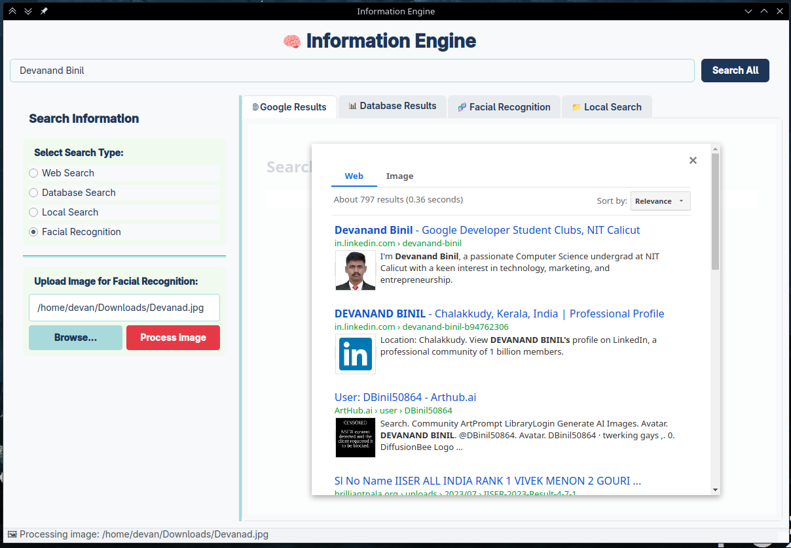
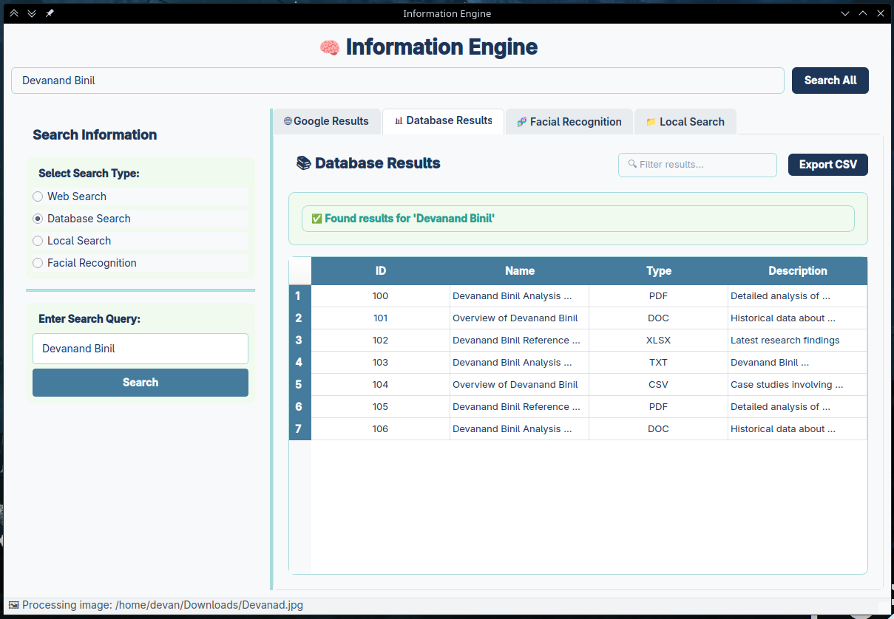
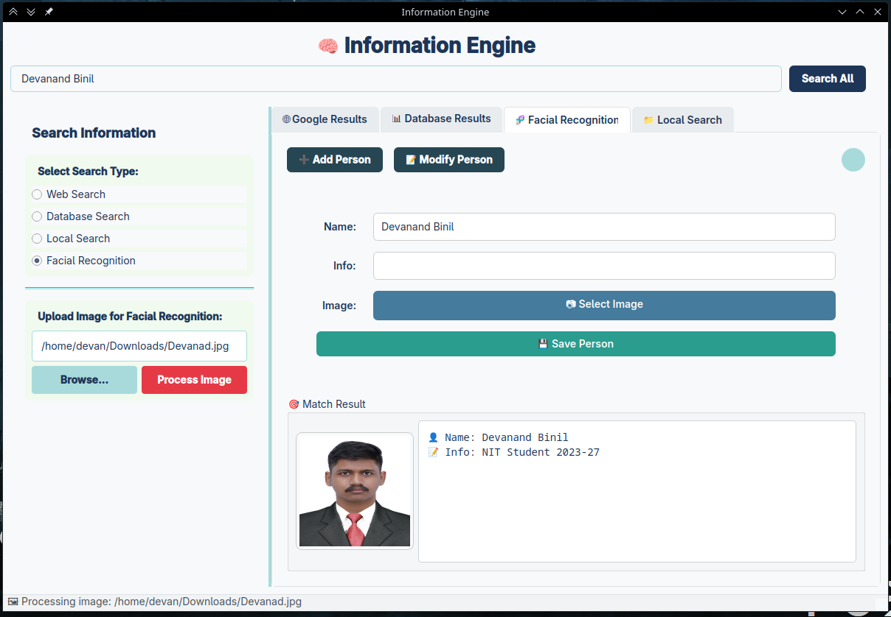
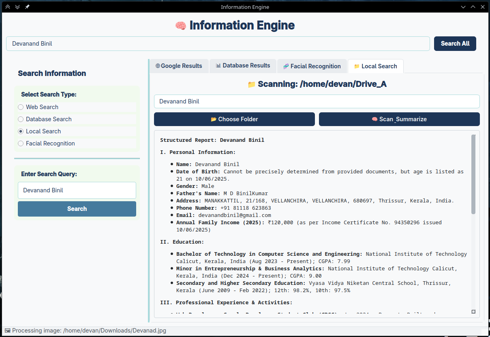

# 🧠 Info-Engine

A modular, scalable, and offline-capable intelligence tool that allows users to:

* Detect and identify people via facial recognition
* Search scanned files (PDF, DOCX, TXT) for names, places, or events
* Summarize findings using Google Gemini API
* Connect and query external databases
* Perform programmable web searches with Google CSE

> Built to simulate the functionality of an elite agency-grade information extraction engine.

---

## 🚀 Features

* 🔍 **Global Search**: Unified search bar for querying across all data sources
* 🧬 **Facial Recognition**: Add, modify, and match faces with metadata using local encoding and SQLite
* 📁 **Local File Scanning**: Searches through PDFs, Word docs, and text files, then summarizes matches using Gemini
* 🌐 **Google Search Integration**: Uses Google Programmable Search Engine to fetch real-time web results
* 📊 **Database Search**: Connects to any SQL-compatible database for querying local records
* 💡 **Modular Design**: Each tool is built as an independent widget and easily extensible
* 🌗 **Theme Toggle**: Light/Dark theme support for usability
* 💼 **Portable**: Runs offline (except web search & Gemini) and is easy to deploy

---

## 💪 Technologies Used

| Category           | Tools & Libraries                          |
| ------------------ | ------------------------------------------ |
| GUI Framework      | PyQt5                                      |
| Facial Recognition | `face_recognition`, `sqlite3`, `pickle`    |
| File Scanning      | `fitz` (PyMuPDF), `docx`, `markdown`       |
| Web Integration    | Google CSE API, Gemini (Groq / Gemini Pro) |
| Backend (optional) | Flask / FastAPI (for web conversion)       |
| Styling            | Custom PyQt Stylesheets                    |

---

> ⚠️ **Important:**  
> This project is compatible only with **Python 3.10 or earlier**.  
> Newer versions (e.g., Python 3.11+) may cause issues with the `face_recognition` library due to dependencies like `dlib`.  
>  
> ✅ Recommended: Use **Python 3.8 – 3.10** for stable performance.


## 💻 Installation

```bash
# Clone the repository
git clone https://github.com/yourusername/infoengine.git
cd infoengine

# Create a virtual environment
python3 -m venv venv
source venv/bin/activate   # On Windows: venv\Scripts\activate

# Install dependencies
pip install -r requirements.txt

# Run the search server(terminal 1)
python search_server.py

# Run the application (terminal 2)
python main.py


```

---

## 🔐 API Keys Required

| API              | How to Use                                          |
| ---------------- | --------------------------------------------------- |
| Google CSE       | Set your Search Engine ID in `cse.html`             |
| Gemini (or Groq) | Add your key in `local_file_search.py` as `api_key` |

> 🛡️ For production, store keys in environment variables or a `.env` file (use `python-dotenv`).

---

## 🧪 Use Cases

| Use Case                      | Module               |
| ----------------------------- | -------------------- |
| Identify person from photo    | Facial Recognition   |
| Analyze scanned reports       | Local File Scanner   |
| Investigate events/places     | Summarization Engine |
| Investigate digital footprint | Google Results       |
| Lookup local database records | Database Search      |

---

## 🌐 Deployment Options

| Option             | Stack                     |
| ------------------ | ------------------------- |
| Local              | Python + PyQt5 (current)  |
| Web (future)       | Flask + React / Next.js   |
| Hosting            | Render / Railway / Vercel |
| Desktop/Web Hybrid | Tauri or Electron         |

---

## 📸 Screenshots

| Feature                  | Preview                                          |
| ------------------------ | ------------------------------------------------ |
| 🌐 Google Search Results |              |
| 📊 Database Search       |                    |
| 🧬 Facial Recognition UI |                   |
| 📁 Local File Scanner    |                 |


---

## 🗓️ Future Plans

* 🌐 Web-based frontend using Next.js
* 🔒 Role-based access control


---


## 👨‍💼 Developed by

Devanand Binil
Computer Science & Engineering
NIT Calicut

